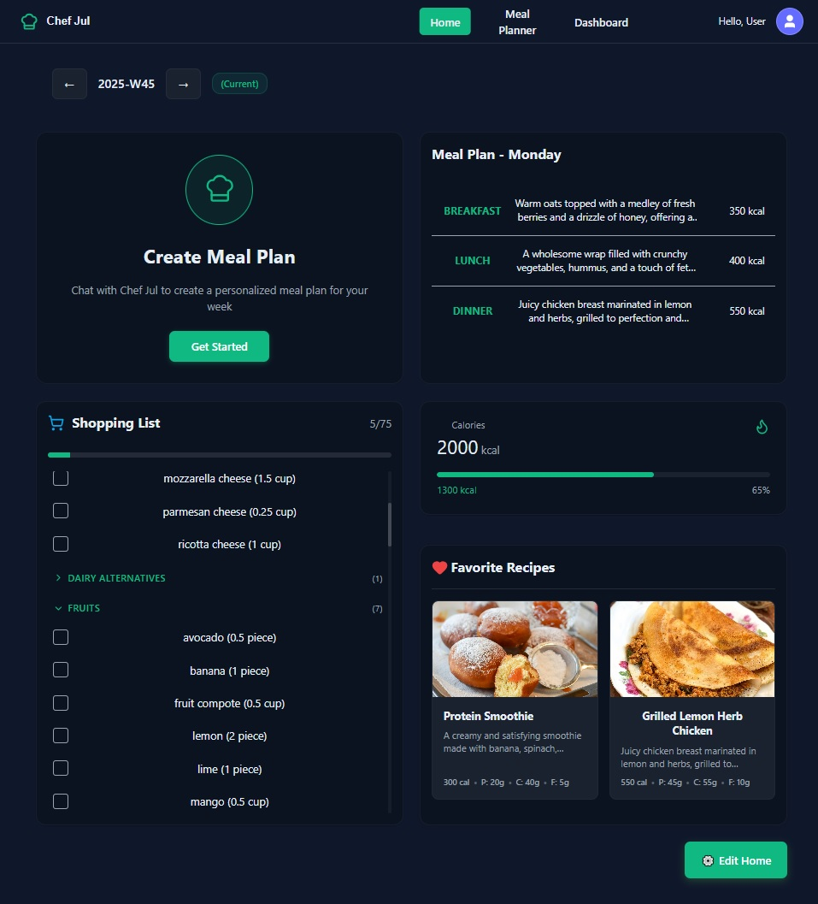
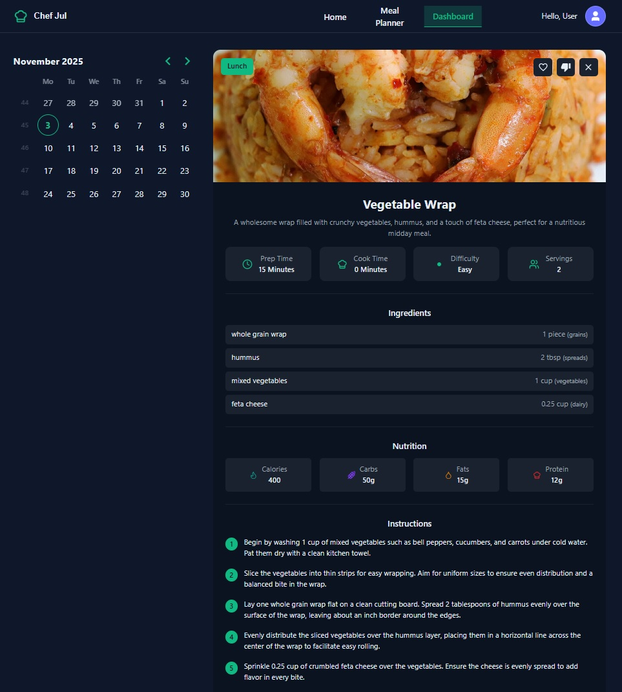
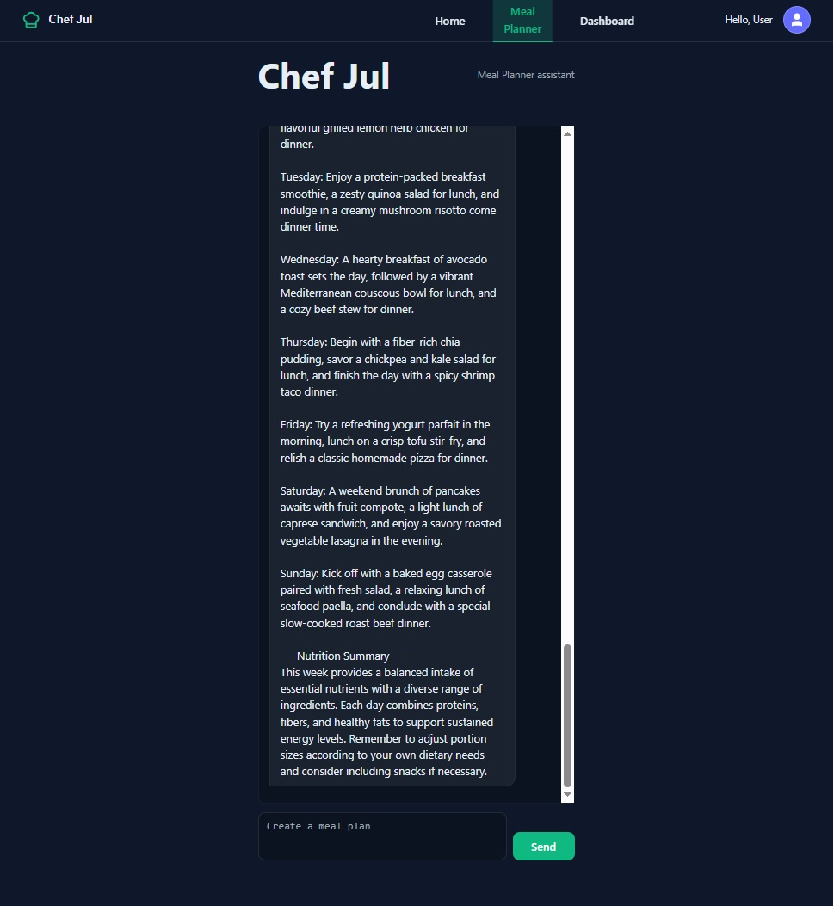
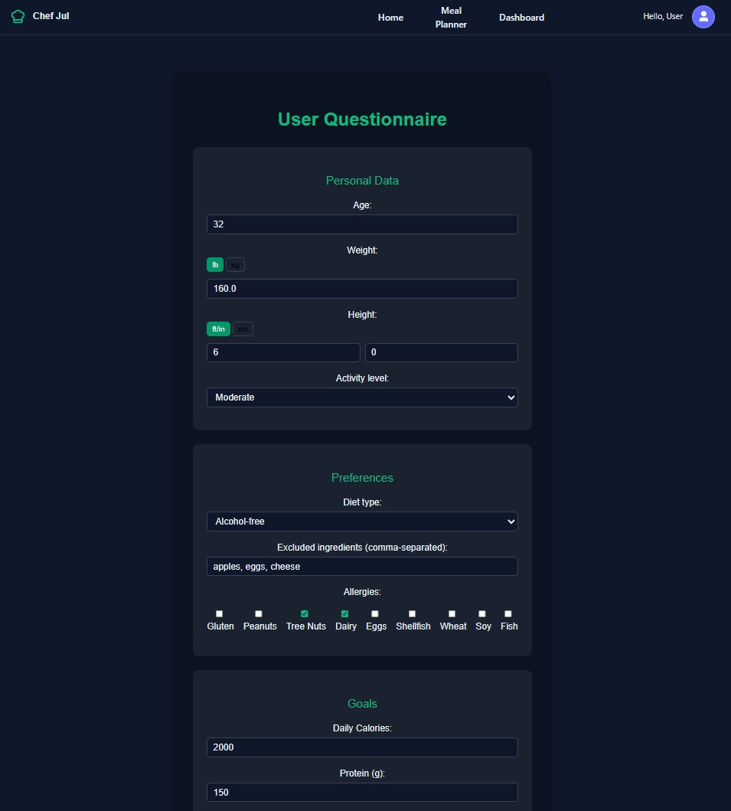
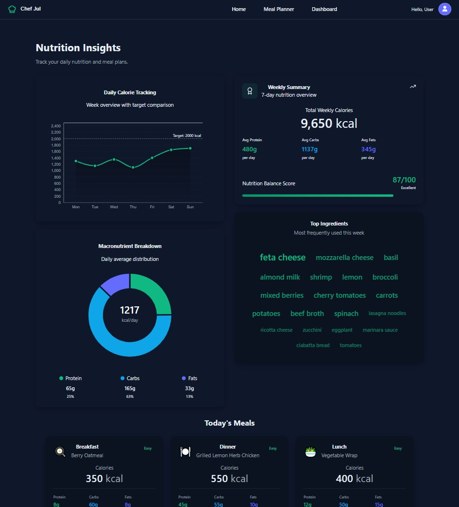

# 🧑‍🍳 Meal Planning App –   

🏆 **2nd Place Winner – Halloween Hackathon 2025**  
⚡ **Built in 3 Days | Powered by MetLife Hackathon**  

An **AI-powered meal planning platform** that helps users create personalized weekly meal plans, track nutrition, and manage smart shopping lists — all with the help of our charming assistants **Chef Jul** and **Julie**.  

---

## 🚀 Live Demo  
👉 [https://ctd-hackaton.web.app/](#)  
💻 [https://github.com/ctd-hackaton/front-end](#)

---

## 📸 App Overview

Our app **Jul & Julie** is a complete AI-powered meal planning assistant — from meal generation to shopping list and nutrition tracking.  
Here’s a quick visual walkthrough of the main pages:

---

### 🖥️ Welcome Page

  
   
  <em>Friendly welcome screen introducing Chef Jul & Julie and inviting users to start their AI-powered meal planning journey.</em>

---

### 🍽️ Home Dashboard

  
   
  <em>Daily overview of your meals, nutrition goals, and smart shopping list — everything at a glance.</em>

---

### 📅 Weekly Meal Planner

  
   
  <em>Full week calendar where users can view, edit, or replace meals with Julie, the AI sous-chef.</em>

---

### 💬 AI Chat Assistant

  
   
  <em>Chat interface with Chef Jul — create or modify meal plans using natural conversation with real-time streaming responses.</em>

---

### 🧠 Questionnaire

  
   
  <em>Personalization form where users set their dietary goals, preferences, and calorie targets.</em>

---

### 📊 Statistics & Insights

  
   
  <em>Visual analytics dashboard with daily nutrition breakdown, goal tracking, and macro distribution charts.</em>

---

---

## 🌟 Key Features  

### 👨‍🍳 AI Assistant – *Chef Jul*
- Conversational meal planning  
- Real-time streaming responses  
- Fun, contextual messages (“Sprinkling some culinary magic...”)  
- Saves chat history to Firebase  

### 🧑‍🍳 Sous-Chef Julie  
- In-dashboard AI that helps modify meal plans  
- Replace meals, suggest alternatives, or adjust portions  
- Context-aware of your current week’s plan  

### 🏠 Smart Home Dashboard  
- Interactive cards for meals, favorites, and progress  
- Weekly overview of calories, meals, and nutrition goals  
- Auto-generated shopping list with progress tracking  

### 📊 Weekly Statistics  
- Daily calorie charts  
- Goal comparison and macro balance  
- Ingredient cloud built with **D3.js** — a powerful visualization library that drives most JavaScript data charts on the web.  
  It gave us full control over animations, SVG rendering, and custom tooltips — impossible with standard chart libraries.  

### 💬 Chat Integration  
- Live-streaming AI chat experience  
- Context-aware prompts based on user goals  
- Seamless switch between meal planning and editing  

### 👤 User Profile & Personalization  
- Questionnaire for user goals, allergies, and preferences  
- Calorie/protein/fat targets  
- All data stored and editable in Firebase  

### 🛒 Smart Shopping List  
- Auto-generated from all weekly meals  
- Categorized by food type  
- Persistent check-off states  
- Helps reduce waste and overbuying  

---

## 💻 Technical Stack  

| Area | Technology |
|------|-------------|
| Frontend | React 18 + Vite |
| State Management | React Hooks |
| Routing | React Router 6 |
| Database | Firebase Firestore |
| Auth | Firebase Authentication |
| AI | GPT-powered chat with streaming responses |
| Styling | CSS Modules + CSS Variables |
| Visualization | **D3.js** for custom animated charts |
| Date Utilities | date-fns |
| Hosting | Firebase Hosting |

---

## 🎨 Design Highlights  

- Modern **Dark Theme** with emerald accents  
- Consistent visual style across all pages  
- Smooth animations and hover effects  
- User-friendly layout and empty states  
- Responsive design for any screen size  

---

## 💬 User Flow  

1. **Sign In** → Welcome screen  
2. **Set Goals** → Dietary preferences, calorie targets  
3. **Chat with Jul** → Generate a weekly plan  
4. **View Dashboard** → Meals, goals, and progress  
5. **Adjust Plan with Julie** → Refine meals instantly  
6. **Shop Smart** → Auto-generated categorized shopping list  
7. **Track Progress** → Visualize calories and ingredients  

---

## 🧠 Unique Selling Points  

- **Two AI Assistants** – Chef Jul & Julie  
- **Auto-Aggregated Shopping Lists**  
- **Real-time Streaming Chat**  
- **Custom D3 Visualizations**  
- **Week-by-Week History**  
- **Cloud Persistence & Multi-Device Sync**  
- **Intuitive Dark UI with Smart Widgets**

---

## 🧭 Future Enhancements  

- Mobile version  
- Grocery delivery integration  
- Recipe photo uploads  
- Voice interaction  
- Calendar & health app integrations  
- Community recipe sharing  

---

## 🥇 Summary  

**Jul & Julie** isn’t just a hackathon project — it’s a glimpse into the future of **AI-powered personal nutrition**.  
From planning to shopping to cooking — it all happens in one intuitive, beautiful, and intelligent experience.  

> “Healthy eating, made simple — with a touch of AI magic.” ✨
